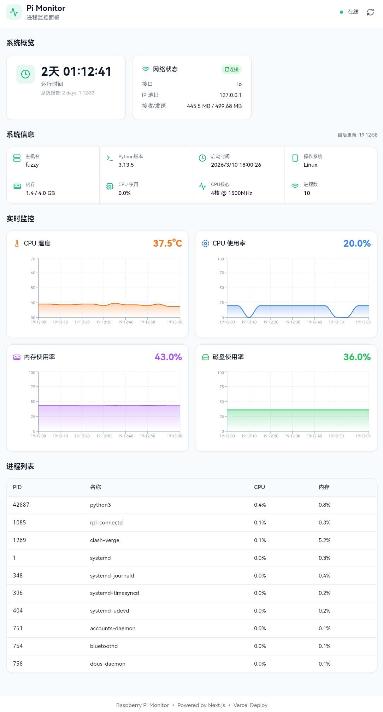
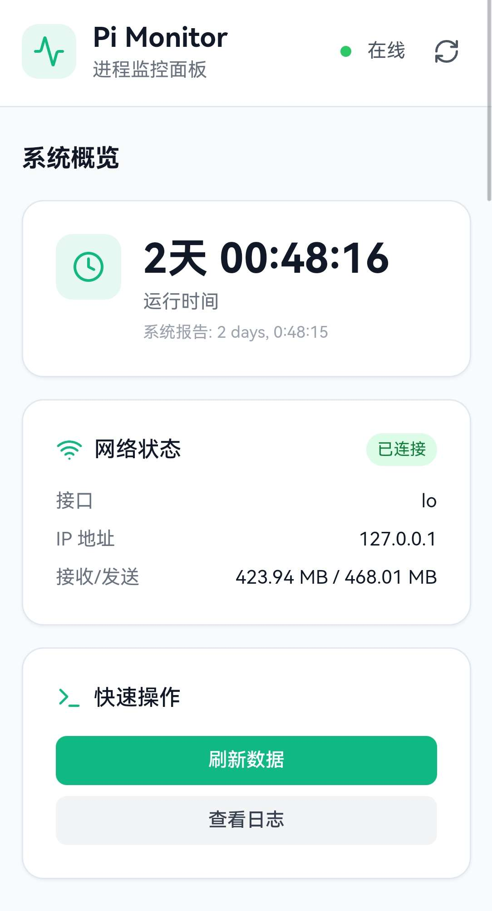
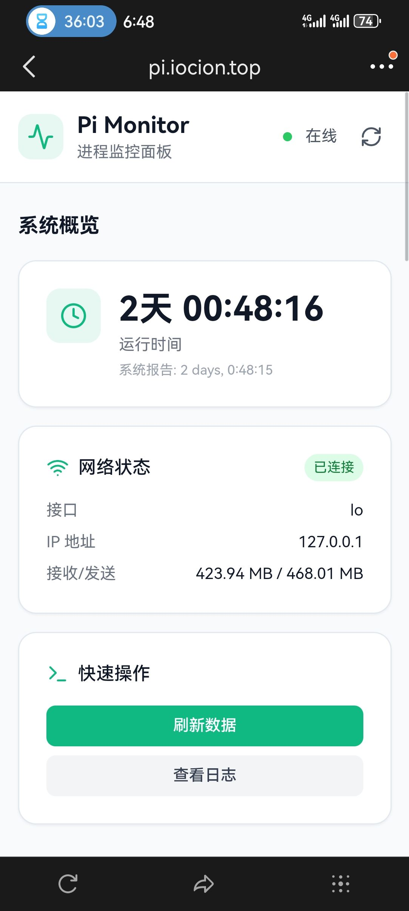
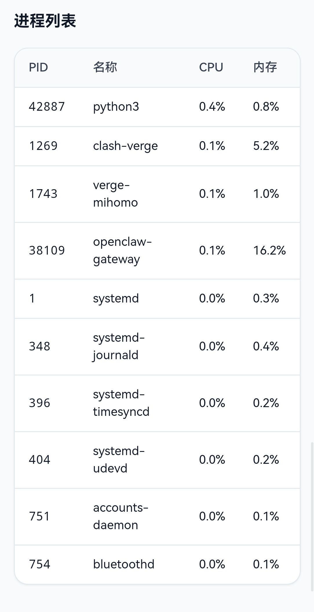

# Pi Monitor Dashboard

为 Raspberry Pi 打造的现代化系统监控面板。



## 特性

- 📊 **实时监控**: CPU 温度、使用率、内存、磁盘可视化图表
- ⏱️ **运行时间**: 精确的运行时间统计
- 📱 **移动端适配**: 完美支持手机端显示
- 🔄 **自动刷新**: 5秒间隔实时数据更新
- 📋 **进程列表**: 显示当前运行的进程信息
- 🎨 **现代UI**: 参考系统概览卡片风格设计

## 技术栈

- **框架**: Next.js 14 + React 18 + TypeScript
- **样式**: Tailwind CSS
- **图表**: Recharts
- **图标**: Lucide React
- **部署**: Vercel (自动部署)

## 本地开发

```bash
# 安装依赖
npm install

# 启动开发服务器
npm run dev

# 访问 http://localhost:3000
```

## 构建

```bash
npm run build
```

静态文件将输出到 `dist/` 目录。

## Vercel 部署

### 方法一：通过 GitHub 自动部署 (推荐)

1. 在 GitHub 创建新仓库 `pi-monitor-dashboard`
2. 推送代码到仓库：
   ```bash
   git remote add origin https://github.com/iocion/pi-monitor-dashboard.git
   git branch -M main
   git push -u origin main
   ```
3. 登录 [Vercel](https://vercel.com)
4. 点击 "New Project"
5. 导入 `pi-monitor-dashboard` 仓库
6. 框架预设选择 "Next.js"
7. 点击 "Deploy"

### 方法二：直接上传

1. 运行 `npm run build` 生成 `dist/` 目录
2. 登录 [Vercel](https://vercel.com)
3. 点击 "New Project" → "Upload"
4. 上传 `dist/` 文件夹内容

## 连接后端数据

当前使用的是模拟数据。要连接真实的 `monitor.py` 后端：

1. 修改 `pages/index.tsx` 中的数据获取逻辑
2. 可以：
   - 使用 Upstash Redis (如原脚本)
   - 搭建简单的 HTTP API
   - 使用 WebSocket 实时推送

## 项目结构

```
pi-monitor-dashboard/
├── pages/
│   ├── _app.tsx          # 应用入口
│   └── index.tsx         # 主页面
├── styles/
│   └── globals.css       # 全局样式
├── public/               # 静态资源
├── next.config.js        # Next.js 配置
├── tailwind.config.js    # Tailwind 配置
└── package.json          # 依赖
```

## 截图展示 🤓

### 系统概览面板
显示运行时间、网络状态、快速操作按钮



### 移动端适配
完美支持手机浏览器访问，随时随地监控你的 Pi



### 进程列表
实时显示当前运行的进程，包括 PID、名称、CPU 和内存占用



> 截图展示的是 Raspberry Pi 5 的实际运行状态，包括 openclaw-gateway 等进程

## License

MIT